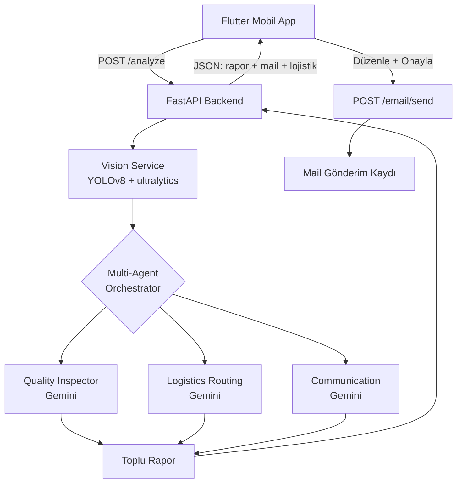

# 🍎 Agrotech-AI

> Otonom Kalite Kontrol ve Fire Ajanı — YZTA 5. Dönem AI Hackathon Projesi

Tarım kooperatifleri ve gıda işletmeleri için manuel kalite kontrol ve fire takip süreçlerini otomatize eden, **agentic** bir yapay zeka sistemi. Sistem sadece çürük ürünleri tespit etmekle kalmaz; fire oranını ve maddi zararı hesaplar, tedarikçiye iade maili taslar ve hasarlı ürünleri sürdürülebilir kanallara (salça, kompost) yönlendirir.

## ✨ Özellikler

- **Görsel kalite analizi:** Özel olarak eğitilmiş YOLOv8 modeli ile kasadaki ürünlerin anında çürük/taze sınıflandırması ve sayımı
- **Multi-agent pipeline:** Quality Inspector → Logistics → Communication ajanları zinciri (Google Gemini API ile structured output)
- **Maddi zarar hesabı:** Tespit edilen fire oranından otomatik kayıp tahmini ve hasar dağılımı (ezik / çürük / lekeli)
- **Otomatik tedarikçi maili:** Fire kritik eşiği geçtiğinde Gemini tarafından üretilen kanıt fotoğraflı iade taslağı; kullanıcı taslağı düzenleyip onaylayarak gönderir
- **Sıfır atık tavsiyesi:** Hasarlı ürünleri salça / meyve suyu / turşu / kompost tesislerine kategoriye göre yönlendirme, geri kazanım değeri hesaplama
- **Mobil arayüz:** Flutter ile geliştirilmiş, depo yöneticisinin günlük kullanımına uygun, kameradan tek dokunuşla analiz başlatan tasarım
- **Dayanıklılık:** Tüm Gemini çağrılarında otomatik retry logic (3 deneme, exponential backoff) ve kural tabanlı fallback — sistem 503'lerde çökmez

## 🏗️ Mimari



**Akış özeti:**
1. Kullanıcı Flutter'dan kasa fotoğrafını çeker, FastAPI'ye yollar
2. Vision Service YOLOv8 ile ürünleri sınıflandırır (taze / hasarlı)
3. Orchestrator üç Gemini ajanını sırayla çalıştırır:
   - **Quality Inspector** → Türkçe kalite raporu (özet, severity, hasar kategorileri, tavsiye)
   - **Logistics Agent** → her hasar kategorisi için en uygun işleme tesisi + geri kazanım değeri
   - **Communication Agent** → tedarikçiye gönderilecek profesyonel iade maili taslağı (sadece severity ≥ medium)
4. Sonuçlar tek JSON cevap olarak Flutter'a dönüyor
5. Kullanıcı mail taslağını ekranda düzenleyip onaylayınca `/email/send`'e POST atılıyor

## 🛠️ Teknoloji Yığını

| Katman | Teknoloji |
|---|---|
| **Backend** | Python 3.12, FastAPI, Pydantic, Uvicorn |
| **AI / Vision** | YOLOv8 (özel eğitilmiş), ultralytics |
| **AI / Agent** | Google Gemini 2.5 Flash (structured output, retry logic) |
| **Frontend** | Flutter (mobil + web) |
| **Tünel (test)** | ngrok |

## 🚀 Kurulum

### Backend

```bash
# 1. Repo'yu klonla
git clone https://github.com/ytafk/agrotech-ai.git
cd agrotech-ai

# 2. Virtual environment kur (Python 3.12 önerilir)
python -m venv venv
# Windows:
venv\Scripts\Activate.ps1
# Mac/Linux:
# source venv/bin/activate

# 3. Bağımlılıkları yükle
pip install -r requirements.txt
# Not: ultralytics paketi PyTorch'u da yükler (~600 MB-1 GB)

# 4. .env dosyasını oluştur
copy .env.example .env
# .env'i editleyip kendi API key'lerini ekle (aşağıya bak)

# 5. YOLO modelini indir
# models/ klasörüne rotten_detector_v1.pt dosyasını koy
# (Drive linki: <BURAYA_DRIVE_LİNKİ>)

# 6. Backend'i çalıştır
uvicorn backend.main:app --reload --host 0.0.0.0
# Swagger UI: http://localhost:8000/docs
```

### Frontend (Flutter)

```bash
cd flutter_app
flutter pub get
flutter run
# Backend URL'i app içinden ngrok adresine veya kendi LAN IP'ne ayarla
```

### Mobilden Test İçin Backend'i Dışa Açma (Opsiyonel)

```bash
# ngrok kurulu ve authtoken eklenmiş olmalı
ngrok http 8000
# Çıkan https://....ngrok-free.dev URL'ini Flutter'a base URL olarak ver
```

## 🔑 Gerekli API Key'ler

- **Google Gemini API** → [aistudio.google.com](https://aistudio.google.com) → Get API Key
- **Roboflow API** *(opsiyonel — sadece referans veri seti için)* → [roboflow.com](https://roboflow.com)

`.env.example` dosyasındaki tüm değişkenleri doldur:

```
GEMINI_API_KEY=AIzaSy_...
ROBOFLOW_API_KEY=rf_...
YOLO_MODEL_PATH=models/rotten_detector_v1.pt
YOLO_CONFIDENCE=0.50
```

## 📁 Proje Yapısı

```
agrotech-ai/
├── backend/
│   ├── main.py                        # FastAPI uygulaması, endpoint tanımları
│   ├── orchestrator.py                # Multi-agent pipeline yöneticisi
│   ├── services/
│   │   └── vision_service.py          # YOLOv8 inference
│   └── agents/
│       ├── _gemini_helper.py          # Ortak Gemini çağrı + retry logic
│       ├── quality_agent.py           # Kalite raporu üreten ajan
│       ├── logistics_agent.py         # Sıfır atık yönlendirme ajanı
│       └── communication_agent.py     # Tedarikçi mail taslağı yazan ajan
├── flutter_app/                       # Flutter mobil/web istemci
│   ├── lib/
│   │   ├── core/                      # Tema, sabitler
│   │   ├── features/                  # Dashboard, scanner, agent ekranları
│   │   └── services/                  # API client
│   └── pubspec.yaml
├── models/                            # YOLO ağırlıkları (.pt — .gitignore'da)
├── data/sample_images/                # Test fotoğrafları
├── notebooks/                         # Vision deneme defterleri
├── .env.example                       # Şablon ortam değişkenleri
└── requirements.txt                   # Python bağımlılıkları
```

## 🔌 API Endpoint Özeti

| Method | Path | Açıklama |
|---|---|---|
| `GET` | `/` | Servis durumu |
| `GET` | `/health` | Sağlık kontrolü |
| `POST` | `/analyze` | Fotoğraf → tam analiz (vision + 3 ajan) |
| `GET` | `/suppliers` | Tedarikçi listesi |
| `GET` | `/facilities` | İşleme tesisleri listesi |
| `POST` | `/email/send` | Onaylanmış mail gönderimi |
| `GET` | `/email/history` | Gönderilmiş mail geçmişi |

Tam şema ve test arayüzü: `http://localhost:8000/docs`

## 🧠 Yapay Zeka Kullanımı

Proje sadece "AI'lı" bir görüntü işleme uygulaması değil, gerçek anlamda **agentic** bir sistemdir:

- **Vision Layer (YOLOv8):** Görüntüden nesne tespiti — deterministik, hızlı, tek sorumluluğu var
- **Agent Layer (Gemini × 3):** Her ajan kendi sistem prompt'u, kendi structured output şeması ve kendi tools'u ile çalışır. Quality interpretation, logistics decision making ve communication drafting birbirinden bağımsız sorumluluklar olarak ayrılmıştır
- **Orchestration Layer:** Pipeline mantığı (severity'e göre koşullu ajan çağrısı, hasar yoksa logistics'in atlanması vb.) tek bir yerde toplanmış, ajanlar birbirinden habersiz çalışır
- **Resilience:** Her Gemini çağrısı 3 deneme + exponential backoff ile sarılı; kalıcı hata durumunda her ajanın kendi fallback'i devreye girer ve sistem hiçbir koşulda çökmez

## 👥 Ekip

- **Yiğit** — Backend & Multi-Agent Mimarı
- **Gizem** — AI / Computer Vision
- **Ezgi** — Frontend & UX

## 📹 Demo

[YouTube video linki — 13 Mayıs'ta eklenecek]

## 📄 Lisans

MIT       bu proje hakkında ne düşünüyorsun