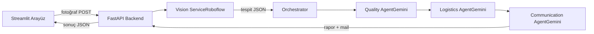

# 🍎 Agrotech-AI

> Otonom Kalite Kontrol ve Fire Ajanı — YZTA 5. Dönem AI Hackathon Projesi

Tarım kooperatifleri ve gıda işletmeleri için manuel kalite kontrol ve fire takip süreçlerini otomatize eden, **agentic** bir yapay zeka sistemi. Sistem sadece çürük ürünleri tespit etmekle kalmaz; fire oranını ve maddi zararı hesaplar, tedarikçiye iade maili taslar ve hasarlı ürünleri sürdürülebilir kanallara (salça, kompost) yönlendirir.

## ✨ Özellikler

- **Görsel kalite analizi:** Roboflow Universe / YOLOv8 ile kasadaki ürünlerin anında çürük/taze sınıflandırması
- **Multi-agent pipeline:** Quality Inspector → Logistics → Communication ajanları zinciri (Gemini API)
- **Maddi zarar hesabı:** Tespit edilen fire oranından otomatik kayıp tahmini
- **Otomatik tedarikçi maili:** Fire kritik eşiği geçtiğinde kanıt fotoğraflı iade taslağı
- **Sıfır atık tavsiyesi:** Hasarlı ürünleri salça/meyve suyu/kompost tesislerine yönlendirme
- **Yönetici paneli:** Geçmiş analizler, fire trendi, toplam kayıp

## 🏗️ Mimari



## 🛠️ Teknoloji Yığını

- **Backend:** Python, FastAPI, Pydantic
- **AI/Vision:** Roboflow Inference SDK, YOLOv8 (Universe pre-trained)
- **AI/Agent:** Google Gemini API (function calling, structured output)
- **Frontend:** Streamlit

## 🚀 Kurulum

```bash
# 1. Repo'yu klonla
git clone https://github.com/ytafk/agrotech-ai.git
cd agrotech-ai

# 2. Virtual environment kur
python -m venv venv
# Windows:
venv\Scripts\Activate.ps1
# Mac/Linux:
# source venv/bin/activate

# 3. Bağımlılıkları yükle
pip install -r requirements.txt

# 4. .env dosyasını oluştur
copy .env.example .env
# .env'i editleyip kendi API key'lerini ekle

# 5. Backend'i çalıştır
uvicorn backend.main:app --reload

# 6. (Yeni terminalde) Frontend'i çalıştır
streamlit run frontend/app.py
```

## 🔑 Gerekli API Key'ler

- **Gemini API:** [aistudio.google.com](https://aistudio.google.com) → Get API Key
- **Roboflow API:** [roboflow.com](https://roboflow.com) → Settings → Roboflow API

## 📁 Proje Yapısı

```
agrotech-ai/
├── backend/
│   ├── main.py              # FastAPI uygulaması
│   ├── services/            # Dış servisler (Roboflow)
│   ├── agents/              # Gemini ajanları
│   └── orchestrator.py      # Ajan zinciri
├── frontend/
│   └── app.py               # Streamlit arayüzü
├── notebooks/               # Vision deneme defterleri
└── data/sample_images/      # Test fotoğrafları
```

## 👥 Ekip

- **Üye 1** — AI / Computer Vision
- **Üye 2** — Backend & Multi-Agent Mimarı
- **Üye 3** — Frontend & UX

## 📹 Demo

[YouTube video linki — 13 Mayıs'ta eklenecek]

## 📄 Lisans

MIT